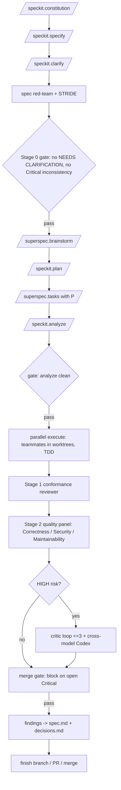

# Superspec Supercharged v2: The Complete Playbook

> **Scope note (decided 2026-09-11):** this playbook targets Claude Code (Claude
> CLI) and the GitHub Copilot CLI. The Codex CLI is not a runtime target for
> `specflow/` and is not part of the shipped extension, so this playbook carries
> no Codex install steps and no Codex CI step. Codex stays an allowed implementer
> and cross-model reviewer for this repo's own development: the `codex review` and
> `codex:codex-rescue` references below are current, as are the Codex executor
> lines in `imporvements/tasks.md`.

## Part 0 — Executive Summary + What's New in v2

Superspec (WangX0111/superspec) is a thin, useful, but early-stage MIT-licensed bridge that wires GitHub Spec Kit's governance artifacts to obra/superpowers' execution skills; the fastest way to "supercharge" it is not to fork it but to wrap it in deterministic hooks, a hardened multi-lens adversarial review stack, and cross-model verification — all of which sit on native Claude Code and Codex primitives you already have.

This v2 keeps every item, template, command, and verified fact from the two v1 deliverables and adds substantially more. Everything added is tagged **NEW in v2**.

**What's new in v2 (changelog):**
- **NEW:** Refreshed verification of Superspec, Spec Kit, superpowers (through v6.3.0), Claude Code hooks (33 events), subagents frontmatter, Agent Teams, headless flags (dollar-budget cap), and Codex (`codex exec`, `codex review`).
- **NEW improvement items (13–22):** memory/knowledge layer (CLAUDE.md hierarchy + `@import` + ADRs), differential/N-version implementation, security scanning layer (`/security-review` + SAST), test amplification (mutation/property/fuzz), PR automation (GitHub App + `@claude`), pipeline eval harness, spec change management, long-running/resumable runs, threat modeling + traceability matrix, cost governance.
- **NEW adversarial-review research:** LLM-as-judge bias catalog (self-preference, position, verbosity), limits of self-correction, multi-agent debate lineage, CriticGPT lesson, reviewer calibration/scorecards, risk-classification rules, JSON findings schema, full agent definitions, and an updated plugin comparison.
- **NEW implementation kit:** complete ready-to-paste `.claude/settings.json`, `block-main-commit.sh`, `test-gate.sh`, `artifact-lint.sh`, `log-phase.sh`, dispatcher `SKILL.md`, `decisions.md`/`open-questions.md` templates, findings schema, `merge-gate.sh`, GitHub Actions workflow, PR template, risk-classifier, model-routing table.
- **NEW usage scenarios:** resume-after-compaction, spec change mid-flight, hotfix path, multi-feature concurrency, onboarding, brownfield migration, fully headless, Codex-primary end-to-end.
- **NEW sections:** Team Operations (roles, gates, SLAs, KPIs), Anti-Patterns catalog, updated 30-60-90 roadmap, and appendices.

---

## Part 1 — Superspec Today (refreshed verification)

**Verified live, Sept 11 2026** (GitHub repo page for WangX0111/superspec, repo id 1217951047; description confirmed "Superpowers Bridge for Spec-Kit — Bridges spec-kit specification-driven development with obra/superpowers agent capabilities"):

- **What it is.** A Spec-Kit extension / agent skill (id `superpowers`, "Superpowers Bridge") that bridges GitHub Spec Kit's governance artifacts with obra/superpowers' execution skills. MIT licensed. Small, early, lightly maintained.
- **Install.** Catalog: `specify extension add superspec`. Pinned release: `specify extension add superspec --from https://github.com/WangX0111/superspec/archive/refs/tags/v1.0.1.zip` (tag v1.0.1 is the version on the SpecKit Extensions community page — **verify the latest tag in your version**). From source: `git clone https://github.com/WangX0111/superspec.git` then `specify extension add ./superspec --dev`. As an agent skill: symlink into `~/.claude/skills/superspec`, `~/.codex/skills/superspec`, or `~/.agents/skills/superspec`. Confirm with `/speckit.superspec.status`.
- **Commands.** Adds 5 commands on top of Spec Kit's core: `/speckit.superspec.status`, `/speckit.superspec.brainstorm`, `/speckit.superspec.tasks`, `/speckit.superspec.execute`, `/speckit.superspec.review`. (The repo README's own "5 commands" note lists core Spec Kit commands `/speckit.constitution`, `/speckit.specify`, `/speckit.plan`, `/speckit.tasks`, `/speckit.checklist` — **verify the exact roster in your installed version**.)
- **Flow.** README describes a 7-stage flow (constitution → specify → brainstorm → plan → tasks → execute → review); the architecture diagram groups it into 6 phases.
- **State.** Persisted as markdown/YAML under `.specify/memory/` (governance) and `specs/NNN-*/` (per-feature: `spec.md`, `plan.md`, `tasks.md`, `progress.yml`), making runs resumable.
- **Delegation.** When superpowers is installed, Superspec auto-detects and delegates: brainstorm→`brainstorming`, tasks→`writing-plans`, execute→`executing-plans`+`subagent-driven-development`+`test-driven-development`, review→`requesting-code-review`; otherwise it falls back to built-in behavior.
- **Example.** `examples/static-landing-page/` is a verbatim disk snapshot of a full Claude Code run, reproducible via `scripts/e2e-agent-claude.sh`.

**Verified dependencies (refreshed):**

- **GitHub Spec Kit (github/spec-kit).** Install: `uv tool install specify-cli --from git+https://github.com/github/spec-kit.git` (persistent) or `uvx --from git+... specify init <project> --ai claude` (one-shot). Core slash commands: `/speckit.constitution`, `/speckit.specify`, `/speckit.clarify`, `/speckit.plan`, `/speckit.checklist`, `/speckit.tasks`, `/speckit.analyze`, `/speckit.implement`. `clarify`, `checklist`, `analyze` are the quality gates. Independent tasks in `tasks.md` are tagged `[P]`. **NEW verified:** the extension mechanism is current — `specify extension search`, `specify extension add <id>`, `... --from <url>`, `... --dev <path>`; extensions install under `.specify/extensions/` and register namespaced `speckit.{extension-id}.{command}` commands into the agent's command dir (e.g., `.claude/commands/`). The upstream catalog is **empty by design**; orgs point `SPECKIT_CATALOG_URL` at their own catalog. Spec Kit maintainers explicitly "do not review, audit, endorse, or support extension code." CLI surface changes frequently — verify with `specify --help`.
- **obra/superpowers.** Very active. **NEW refreshed:** current version **v6.3.0** (Aug 12 2026 per the repo release history; DeepWiki indexed it at v6.3.0 on Sept 1 2026). Repo scale ~267k stars, ~23.8k forks (per the v6.1.1 release page). Recent releases: v6.0.0 (rewrite of how subagent-driven-development reviews each task — "cheaper, stricter, and harder to game"), v6.1.x (Codex hook cleanup), v6.2.0 (SDD workspace is now **plan-scoped** — `.superpowers/sdd/<plan-basename>/`; workspace deleted once final review is clean; **caveat: `git clean -fdx` deletes the git-ignored progress ledger — recover from `git log`**), v6.3.0 (harness support, brainstorming router, Codex efficiency). **NEW verified:** **Google EOLed the Gemini CLI on 2026-06-18**, and superpowers removed Gemini CLI support (it "can no longer be installed or updated"). Install (Claude Code): `/plugin install superpowers@claude-plugins-official`, or `/plugin marketplace add obra/superpowers-marketplace` then `/plugin install superpowers@superpowers-marketplace`. Supported harnesses now: Claude Code, Antigravity, Codex, OpenCode, Cursor, Kimi Code, Pi, GitHub Copilot CLI, Devin CLI, Hermes Agent, Grok Build CLI, Factory Droid. Verified skills: `brainstorming`, `using-git-worktrees`, `writing-plans`, `executing-plans`, `subagent-driven-development`, `test-driven-development`, `requesting-code-review`, `receiving-code-review`, `systematic-debugging`, `verification-before-completion`, `dispatching-parallel-agents`, `finishing-a-development-branch`, `writing-skills`, `using-superpowers`. **NEW:** in v6.x, `writing-plans` no longer offers a choice between subagent-driven and executing-plans — on subagent-capable harnesses (Claude Code, Codex) `subagent-driven-development` is **required**; `executing-plans` is reserved for harnesses without subagent capability. `brainstorming` now classifies requests as **spike / bounded / architectural** and small tasks skip the two-document ritual. `export SUPERPOWERS_DISABLE_TELEMETRY=1` to opt out.

**Honest assessment (re-confirmed):** Superspec is a thin, useful bridge but early and lightly maintained. Phase gates are prompt-level, execution is (by default) serial, and "review" is a single-pass `requesting-code-review` call. The value of this playbook is in the deterministic scaffolding you add around it.

---

## Progress checklist (this repo)

- [x] PR template — `.github/pull_request_template.md` (PR #1, merged)
- [x] Item 2 — gate hooks (`block-main-commit.sh`, `test-gate.sh`, `.claude/settings.json`) (PR #2, merged)
- [x] Item 13 — memory layer (`decisions.md`, `open-questions.md`, `@import` in CLAUDE.md) (PR #3, merged)
- [x] Item 4 — artifact linting (`artifact-lint.sh` PostToolUse hook) (PR #4, merged)

## Part 2 — The Focused Improvement Roadmap

All twelve v1 items are kept and refined; ten new items (13–22) are added, each with what / why / how / effort / dependencies.

### Tier 1 — Do first (foundation)

**1. Rewrite the constitution + add project skills** *(v1 #6)* — Replace generic `.specify/memory/constitution.md` with real conventions (error handling, test framework/command, directory layout, forbidden deps, security rules). Add a `## Code Review Rules` section (Codex reads this from the nearest `AGENTS.md`); team-wide rules in root `AGENTS.md`/`CLAUDE.md`, service-specific in nested files; add your own skills (`deploy`, `migrate`, `lint-fix`). **Effort:** low. **Deps:** none.

**2. Enforce gates with hooks** *(v1 #5, refreshed)* — Prompt-level gates get skipped; hooks are deterministic. **NEW refreshed semantics** (Claude Code hooks reference, checked Sept 6 2026, lists **33 hook events**; earlier snapshots list 30–31 — read the official reference): `PreToolUse` is the **only** event where **exit code 2 blocks the tool call** before it runs and feeds stderr back to Claude; `Stop` exit 2 forces Claude to keep working; `SessionStart` (startup/resume/clear/compact) injects context but **exit 2 blocks nothing there**. Critical: **exit 1 only warns; every security-critical gate must exit 2.** Use `exit codes OR JSON on stdout, never both` — JSON is only processed on exit 0, and exit 2 discards it. Five events carry almost all real work: `PreToolUse`, `PostToolUse`, `UserPromptSubmit`, `Stop`, `SessionStart`. `PreToolUse` also supports `hookSpecificOutput.permissionDecision` = allow/deny/ask/defer. **Deps:** #1. **Effort:** low-medium.

**3. Add clarify + analyze + checklist gates** *(v1 #3 NEW item)* — Run `/speckit.clarify` after specify; `/speckit.analyze` after tasks and before implement; `/speckit.checklist` ("unit tests for English"). Gate `implement` on `analyze` reporting no critical inconsistencies. **Effort:** low. **Deps:** Spec Kit.

**4. Artifact linting** *(v1 #4 NEW item)* — A PostToolUse hook / CI step validating `spec.md`/`plan.md`/`tasks.md` structure — required sections, no leftover `[NEEDS CLARIFICATION]` past clarify, stable task IDs, well-formed `[P]`. **Effort:** low. **Deps:** #2. Script in Part 4.

**13. Memory & knowledge layer** — **NEW in v2** — Ground Superspec's `decisions.md`/wisdom idea in Claude Code's memory hierarchy. Use the CLAUDE.md hierarchy — user (`~/.claude/CLAUDE.md`), project (`./CLAUDE.md`), local — plus **`@import` syntax inside CLAUDE.md** to pull in `@.specify/memory/constitution.md`, `@decisions.md`, `@open-questions.md` without duplicating them. Use the `#` shortcut in-session to append a durable memory line. Keep files small: Anthropic's *Effective context engineering for AI agents* (Sept 2025) frames context as "a critical but finite resource," notes LLMs have "an 'attention budget' that they draw on when parsing large volumes of context," and documents **"context rot": "as the number of tokens in the context window increases, the model's ability to accurately recall information from that context decreases."** So prune aggressively and prefer just-in-time retrieval over stuffing. **Effort:** low. **Deps:** #1.

### Tier 2 — Do next (parallelism, review, routing)

**5. Parallelize `[P]` tasks with Agent Teams** *(v1 #1, refreshed)* — **NEW refreshed:** Agent Teams shipped **v2.1.32 (Feb 5 2026)** alongside Opus 4.6 as an experimental research preview; enable with `export CLAUDE_CODE_EXPERIMENTAL_AGENT_TEAMS=1` or `settings.json` `{"env":{"CLAUDE_CODE_EXPERIMENTAL_AGENT_TEAMS":"1"}}`. A **lead** spawns **teammates**, each an independent session with its **own ~1M-token context window**, that **message each other peer-to-peer** via a mailbox and **self-claim tasks from a shared list** — unlike subagents, which only report back to the parent and can't talk to each other. Documented rough edges: `/resume` and `/rewind` **don't restore in-process teammates**; task status can lag; **only one team per session, no nested teams**; teammate permission prompts bubble up to the lead; permissions fixed at spawn. Brief teammates explicitly (they don't inherit history), keep file scopes non-overlapping, give each its own worktree via `using-git-worktrees`. Token-heavy (subagent fan-out can use ~7× tokens). **Alternative for large mechanical sweeps:** Claude Code's Dynamic Workflows / Workflow tool (JS orchestration fanning out to fresh subagents, capped at depth 5, with a grader that revises until a rubric is met). **Effort:** medium. **Deps:** worktrees, #1.

**6. Supercharge adversarial review** *(v1 #7, expanded)* — see Part 3.

**7. Model routing per phase** *(v1 NEW item)* — Cheaper model for mechanical phases; stronger / different-vendor model for brainstorm, spec review, adversarial review. `model` field in `.claude/agents/*.md` (`opus`/`sonnet`/`haiku`/`inherit`); `--model` in headless. **Effort:** low. **Deps:** subagents. Matrix in Appendix B.

**14. Differential / N-version implementation as a spec-ambiguity detector** — **NEW in v2** — Have two independent agents (or **Claude + Codex**) implement the same spec in separate worktrees, then run each other's tests and diff observable behavior. Where they diverge, the spec is ambiguous. Research basis: **N-version programming**, **self-consistency**, and **CodeT** (Chen et al., arXiv 2207.10397), which selects code by a **"dual execution agreement"** — the assumption that "incorrect code solutions are often diverse, and the probability of having a functionality agreement between two incorrect code solutions by chance is very low." CodeT "improves the pass@1 on HumanEval to 65.8%, an increase of absolute 18.8% on the code-davinci-002 model, and an absolute 20+% improvement over previous state-of-the-art results." **When worth it:** high-ambiguity or high-stakes specs only — it roughly doubles implementation cost. **Effort:** medium-high. **Deps:** worktrees, cross-model access.

**15. Security scanning as an objective adversarial layer** — **NEW in v2** — LLM reviewers rubber-stamp; deterministic scanners don't. **Verified:** Anthropic ships a **`/security-review` slash command** in Claude Code and the **`anthropics/claude-code-security-review` GitHub Action** — same analysis, runs on `pull_request`, posts inline findings, with **false-positive filtering**; customize by copying `security-review.md` into `.claude/commands/`. (Anthropic announced these on **Aug 6, 2025** — "We just shipped automated security reviews in Claude Code... /security-review slash command for ad-hoc security reviews [and] GitHub Actions integration for automatic reviews on every PR"; note this is **2025, not 2026**.) It caught real DNS-rebinding RCE and SSRF bugs in Anthropic's own dogfooding. Layer conventional SAST/deps: **Semgrep, CodeQL, gitleaks** (secrets), **OSV-Scanner / trivy** (dependency CVEs). Wire all into the merge gate. **Effort:** low-medium. **Deps:** CI.

**16. Test amplification specifics** — **NEW in v2** — Green tests ≠ good tests. Turn a **mutation-score threshold into a merge gate**. **Tools (verified):** **Stryker** (JS/TS, C#, Scala — `thresholds: {high, low, break}`; exits code 1 below `break`; `--incremental` since 6.2), **mutmut** / **Cosmic Ray** (Python; mutmut has a `--CI` flag), **PIT/PITest** (Java/JVM; Maven `<mutationThreshold>`), **cargo-mutants** (Rust), **Infection** (PHP), **mutant** (Ruby), **go-mutesting/Gremlins** (Go). Property-based: **Hypothesis** (Python), **fast-check** (JS/TS), **proptest** (Rust). Add **metamorphic testing** and **fuzzing** (**libFuzzer/AFL++/Jazzer**) for high-risk code. Workflow: open the HTML report, kill the highest-value surviving mutant on a critical path, ignore equivalent mutants. **Effort:** medium. **Deps:** test runner, CI.

### Tier 3 — As you scale

**8. Close the review loop / wisdom accumulation** *(v1 #8-adjacent)* — Review writes findings back to `spec.md` as open questions; `decisions.md` (ADR-style) read by brainstorm. **Effort:** low. **Deps:** #13.

**9. Observability** *(v1 #8, refreshed)* — One JSON line per phase transition (`Stop`/`SubagentStop`/`TaskCompleted` hooks); `jq`/dashboard; per-phase cost budgets. **NEW refreshed:** headless `--output-format json` returns `total_cost_usd`, `session_id`, `is_error`; **`stream-json` requires `--verbose`.** `log-phase.sh` in Part 4.

**10. CI integration via headless Claude Code** *(v1 NEW item, refreshed)* — `claude -p "<prompt>" --output-format json --allowedTools "Read,Bash(git diff:*)" --max-turns 5`; read-only review; **always wrap in `timeout`**; check exit code and `is_error`; parse defensively. **NEW verified flags:** `--permission-mode` (e.g., `acceptEdits`, `dontAsk`), `--append-system-prompt`, `--json-schema` to validate structured output, and a **print-mode dollar-budget cap** ("stop print-mode execution at an approximate dollar budget" — surfaced in the CLI reference; **verify the exact flag name in your version**). Codex: `codex review --base main --json > review.json`. **Effort:** medium. **Deps:** #6, CI.

**11. Multi-feature concurrency** *(v1 #3, demoted)* — One instance per unapproved spec; constitution as shared contract; integration agent rebases. Native parallel sessions/worktrees (`.claude/worktrees/`) cover most of it; `mohsen1/claude-code-orchestrator` (cco) exists but heavy. **Effort:** high. **Deps:** #5, #1.

**12. Golden examples + regression suite** *(v1 #10)* — Golden `examples/` per project shape; eval harness of golden runs; superpowers itself uses a "drill" eval harness. **Effort:** medium. See #19.

**17. PR automation** — **NEW in v2** — Run `/install-github-app` inside Claude Code — the wizard installs the official GitHub App (github.com/apps/claude), writes `ANTHROPIC_API_KEY`/`CLAUDE_CODE_OAUTH_TOKEN` to repo secrets, and drops a workflow YAML. `@claude` mentions in PRs/issues trigger **`anthropics/claude-code-action@v1`** (pass CLI flags via `claude_args`; use `fetch-depth: 0` so large diffs aren't truncated). Anthropic's managed **Code Review** (research preview) posts inline findings; `/code-review` (alias `/review`) reviews a diff locally, `--fix` applies findings. Use the **GitHub MCP server** for programmatic issue/PR creation, and a PR template linking `spec.md`/`plan.md`/`tasks.md` + review-findings JSON. **Guardrails:** limit triggers, `--max-turns`, job timeouts, concurrency controls, never echo secrets. **Effort:** medium. **Deps:** CI, #6.

**18. Spec change management** — **NEW in v2** — When `spec.md` changes mid-implementation: re-run `/speckit.clarify` → `/speckit.analyze`; regenerate `tasks.md` and **diff it** (preserve stable task IDs so `progress.yml` completion survives); version the spec (append a `## Changelog` with version + date); define a **hotfix path** that bypasses brainstorm but never the merge gate. **Effort:** medium. **Deps:** #4, #8.

**19. Eval harness for the pipeline itself** — **NEW in v2** — Keep golden runs (Superspec's `examples/static-landing-page/` is one, replayable via `scripts/e2e-agent-claude.sh`); build a drill harness (superpowers documents baseline vs GREEN eval runs in `docs/specs/`/`docs/plans/`); score artifact quality (does `spec.md` have all sections? do acceptance criteria map to tests? did the reviewer find the seeded bug?); replay in CI on any change to hooks/agents/skills. **Effort:** medium-high. **Deps:** #12.

**20. Long-running / resumable runs** — **NEW in v2** — Persist `progress.yml` and a short session handoff note; use a `SessionStart` hook (matcher `compact`/`resume`) to re-inject constitution + open questions + current task; resume with `claude --resume "$session_id"` or `--continue`. Note superpowers' v6.2.0 plan-scoped `.superpowers/sdd/<plan>/` ledger and the `git clean -fdx` caveat. **Effort:** medium. **Deps:** #2, #13.

**21. Threat modeling in the spec phase + traceability matrix** — **NEW in v2** — Add a **STRIDE / abuse-case lens** to spec red-team (Spoofing, Tampering, Repudiation, Information disclosure, Denial of service, Elevation of privilege); maintain an **acceptance-criteria → test traceability matrix** (every criterion has ≥1 named test; the conformance reviewer enforces it). **Effort:** low-medium. **Deps:** #3, #6.

**22. Cost governance** — **NEW in v2** — See Part 6 and Appendix B (per-phase budgets, model-routing matrix, token telemetry, Claude budget-cap flag / Max-plan flat rate, Codex pricing modes).

**Multi-harness hygiene** *(v1 #9):* keep `.specify/` neutral; harness bits under `.claude/`/`.codex/`; abstract phase names.

**Intent dispatcher** *(v1 #4, simplified):* a lightweight skill or `UserPromptSubmit` hook mapping "Add feature X"→full pipeline; "Fix bug Y"→`systematic-debugging`→TDD; "Refactor Z"→plan→tasks→execute; "Tighten the rules"→`/speckit.constitution`. Don't build a bespoke `.flow` DSL unless already using `mbruhler/claude-orchestration`. Dispatcher `SKILL.md` in Part 4.

---

## Part 3 — Supercharging Adversarial Review

### 3.1 The core problem (v1)
Superspec's default `requesting-code-review` is a single fresh-context reviewer with severity buckets. A single LLM reviewer is prone to **rubber-stamping (sycophancy)**, **hallucinated issues**, and **false consensus**.

### 3.2 Principles (v1, re-verified)
1. **Fresh context, work-product only** (blind review; superpowers' reviewer uses DESCRIPTION, PLAN_OR_REQUIREMENTS, BASE_SHA, HEAD_SHA).
2. **Independent multiple lenses** (Anthropic "Building Effective Agents").
3. **Structured disagreement beats naive consensus** — the Adversarial Review (AR) protocol (arXiv 2608.18167; **re-confirm ID in your version**): reviewer + critic auditing the review; artifact frozen while review text iterates; "On LiveCodeBench, AR achieves the highest pass rate among tested methods, outperforming a five-agent baseline while using only three agents"; "when two LLM agents are asked to agree on a joint output, they tend to agree with each other... So the protocol must include explicit pushback."
4. **Cross-model / cross-harness review** (Codex reviews Claude, Opus reviews Sonnet).
5. **Reviewer proves bugs with failing tests.**
6. **Adversarial SPEC review before implementation** (pre-mortem; `/speckit.clarify`, `/speckit.analyze`).
7. **Anti-sycophancy prompting** — Rahman et al. (arXiv 2607.10411; **re-confirm ID**) report Decision Flip Rates up to 72% and False Alignment Rates >90% (FAR 100% for Feature Envy on Qwen2.5); never tell the reviewer the author thinks the code is good.
8. **Bounded debate** — ChatEval (arXiv 2308.07201, ICLR 2024): accuracy peaks at 3–4 roles (62.5%) and declines at 5; performance peaked ~2 turns.

### 3.3 LLM-as-judge bias catalog — **NEW in v2**
- **Self-preference bias.** Panickssery, Bowman & Feng, *LLM Evaluators Recognize and Favor Their Own Generations* (NeurIPS 2024, arXiv 2404.13076): LLM evaluators "score their own outputs higher than others' while human annotators consider them of equal quality," and self-preference strength is **linearly correlated with self-recognition capability**. Implication: **use a different-vendor model to review than the one that wrote the code.**
- **Position/order bias** and **verbosity bias** (Wang et al. 2024; Saito et al. 2023): mitigate with **randomized presentation order** and length-normalized rubrics.
- **Narcissistic score inflation** (Liu et al.): don't let a model both write and grade.

### 3.4 Limits of self-correction — **NEW in v2**
Huang et al., *Large Language Models Cannot Self-Correct Reasoning Yet* (ICLR 2024, arXiv 2310.01798): LLMs "struggle to self-correct their responses without external feedback, and at times, their performance even degrades after self-correction." Reviewers therefore need **external signals** — failing tests, SAST tools, other models. Reflexion/Self-Refine help only when grounded in an external verifier; Anthropic's Claude Code best practices echo this ("give Claude a way to verify its work"; explore-plan-code-commit).

### 3.5 Multi-agent debate lineage — **NEW in v2**
- Irving, Christiano & Amodei, *AI Safety via Debate* (arXiv 1805.00899, 2018) — two agents argue, a judge decides.
- Du, Li, Torralba, Tenenbaum & Mordatch, *Improving Factuality and Reasoning through Multiagent Debate* (ICML 2024, arXiv 2305.14325) — instances "propose and debate their individual responses... over multiple rounds," improving factual validity and reducing hallucinations.
- Liang et al. 2023: encouraging divergent thinking **reduces sycophantic convergence** — the basis for AR's mandatory pushback.

### 3.6 CriticGPT lesson — **NEW in v2**
McAleese et al. (OpenAI), *LLM Critics Help Catch LLM Bugs* (arXiv 2407.00215, 2024): "On code containing naturally occurring LLM errors model-written critiques are preferred over human critiques in 63% of cases, and human evaluation finds that models catch more bugs than human contractors paid for code review." **Human+CriticGPT teams** move beyond the model-only frontier with fewer hallucinated bugs. Lessons: (a) a dedicated *critic* role beats a generic reviewer; (b) human-in-the-loop reduces false positives; (c) even trained critics hallucinate — require evidence (file:line, failing test).

### 3.7 The recommended review stack (v1, ranked payoff/cost)
1. **Spec pre-mortem gate** (clarify + analyze + red-team + STRIDE) — very high / very low.
2. **Hardened single reviewer** (anti-sycophancy, mandatory finding, fresh context) — high / low.
3. **Multi-persona panel** (correctness, security, spec-conformance) — high / medium.
4. **Reviewer-writes-failing-tests** (conformance reviewer given only spec) — high / medium.
5. **Critic / debate loop** (AR, ≤3–5 rounds) — medium-high / medium-high (~4.5× tokens).
6. **Cross-model review** — medium / medium.
7. **Test amplification + SAST** — medium / medium.
- **Recommendation:** layers 1–4 default; 5 for high-risk (auth, payments, migrations, security); 6 and 7 in CI for merge-to-main.

### 3.8 Review-phase design (v1)
- **Stage 0 SPEC REVIEW:** clarify → analyze → spec-red-team + STRIDE. Gate: no unresolved `[NEEDS CLARIFICATION]`, no Critical inconsistency.
- **Stage 1 CONFORMANCE:** reviewer sees only `spec.md` + diff; derives tests from acceptance criteria. Gate: every criterion has a passing test.
- **Stage 2 QUALITY PANEL:** 3 personas in parallel fresh contexts — Correctness | Security (OWASP) | Maintainability; each MUST surface ≥1 issue; severity Critical/Important/Minor; issues caught by ≥2 personas promoted one level; high-risk only: critic loop ≤3 rounds.
- **MERGE GATE (mechanical via hook/CI):** block on any open Critical; author fixes or rebuts every Important; findings written to `spec.md` and `decisions.md`.

### 3.9 Reviewer calibration & scorecards — **NEW in v2**
Track **finding precision** per reviewer/persona: accepted ÷ (accepted + rejected-by-critic + rejected-by-human). Keep a **reviewer scorecard** (`.specify/telemetry.jsonl` → weekly `jq` rollup). A persona with precision <0.5 is over-flagging (tighten its "prove the failure mode" requirement); a persona that never gets promoted findings is under-reading (raise its hostility).

### 3.10 Risk classification rules — **NEW in v2**
Escalate to critic loop **and** cross-model review when any of: **paths touched** (`auth/`, `payments/`, `billing/`, `migrations/`, `infra/`, `secrets`, crypto, CODEOWNERS "sensitive"); **diff size** > N lines / > M files (start N=400, M=15); **dependency changes** (lockfiles/manifests); **schema/API** changes. Otherwise run layers 1–4 only. `risk-classifier.sh` in Part 4.

### 3.11 Prompt templates (v1) — full agent files in Part 4.13
Spec red-team reviewer (≥3 findings or prove completeness criterion-by-criterion; `{location, category, why-it-fails, concrete-fix}`); Conformance reviewer (blind, tests-first, read-only on source); Quality panel persona (hostile, ≥1 issue or prove top-5 failure modes absent, evidence required, "UNCERTAIN" allowed, verdict BLOCK|CONCERNS|CLEAN); Critic (reviews THE REVIEW; downgrade/reject unsupported; promote understated; structured disagreement required).

### 3.12 Gating rules, cost controls, pitfalls (v1)
- **Gating:** merge blocked on open Critical (PreToolUse hook on `git merge`/`git push` to main, or CI parsing review JSON); every Important fixed or rebutted; structured JSON output.
- **Cost:** cap rounds (≤3, hard ≤5); 3 personas; cheaper model for mechanical lenses; `--max-turns` + dollar budget cap in CI; reviewers read-only; reuse/cache spec context.
- **Pitfalls:** false consensus/sycophancy; hallucinated issues; over-orchestration (>4 agents worse); context contamination; cost blowups.

### 3.13 Adversarial-review plugin comparison — **NEW in v2 (verified this session)**

| Project | Exists / stars | Status | Roles / personas | Install / invoke | Verdict |
|---|---|---|---|---|---|
| `openai/codex-plugin-cc` | Yes; ~32.7k★ (official OpenAI) | **Very active** (Apache-2.0; launched ~Mar 31 2026) | Single steerable **skeptical Codex reviewer** ("break confidence in the change, not validate it"); read-only; optional review gate | `/plugin marketplace add openai/codex-plugin-cc` → `/plugin install codex@openai-codex` → `/codex:setup`; `/codex:adversarial-review [--base <ref>] [--background]` | **De-facto standard for cross-model review inside Claude Code** |
| `alirezarezvani/claude-skills` (adversarial-reviewer) | Yes; ~25–26k★ (**snippets, not page-verified**) | **Active** (MIT; large mono-repo) | 3 hostile personas: **Saboteur** (prod breaks), **New Hire** (maintainability), **Security Auditor** (OWASP); each must find ≥1 issue | `/plugin marketplace add alirezarezvani/claude-skills` → `/plugin install engineering-skills@claude-code-skills`; `/adversarial-review [--diff HEAD~3]` | **Active; good persona set to borrow** |
| `wan-huiyan/agent-review-panel` (`roundtable`) | Yes; **21★** | **Active but niche** (MIT; v3.5.0, Jun 6 2026) | 4–6 reviewers (Correctness Hawk, Security Auditor, Devil's Advocate, Feasibility, Risk) + a **Supreme Judge**; cost tiers ~$3–$20/run | `claude plugin marketplace add wan-huiyan/agent-review-panel` → `claude plugin install roundtable@agent-review-panel`; `/roundtable:agent-review-panel [deep]` | **Claude-only; borrow the judge pattern** |
| `alecnielsen/adversarial-review` | Yes; **37★** | **Stale / prototype** (MIT; only 2 commits) | Claude + GPT Codex, 4-phase debate loop, loops until both report NO_ISSUES | `git clone` then `./adversarial_review.sh ../my-project` (needs `claude`, `codex`, `jq`) | **Reference only; unmaintained** |

**Other 2025–2026 entrants (existence confirmed; stars/dates not individually page-verified):** `ng/adversarial-review` (Optimizer + Skeptic, cost-gated); `robertoecf/adversarial-review` ("review triad," cross-host routing); `mcarlssen/claude-adversarial-review` (pre-commit skeptic-disproof); `pedronauck`/`poteto-noodle` adversarial-review skill (Skeptic/Architect/Minimalist, auto-scaled). **Official Anthropic:** managed **Code Review** research preview (dispatches parallel agents, verifies findings, ranks severity, posts inline; Team/Enterprise; not OSS) and the **`claude-security` plugin** beta (six-phase scanner; findings must clear a **3-voter adversarial panel — REACHABILITY / IMPACT / DEFENSES — with 2-of-3 quorum**; `/plugin install claude-security@claude-plugins-official`). Anthropic reported Claude Code Security launched as a limited research preview for Enterprise/Team on Feb 19–20 2026 and, using Claude Opus 4.6, "found and validated more than 500 high-severity vulnerabilities in production open-source codebases." **All third-party skills are lightly maintained — vet the source before installing.**

---

## Part 4 — Implementation Kit (ready to paste)

> Paths assume a Spec-Kit project root. Scripts go in `.specify/scripts/hooks/` and must be `chmod +x`. **Verify hook event names, the budget flag, and model IDs against your installed versions.**

### 4.1 `.claude/settings.json`
```json
{
  "env": { "CLAUDE_CODE_EXPERIMENTAL_AGENT_TEAMS": "1" },
  "hooks": {
    "SessionStart": [
      { "matcher": "startup|resume|compact|clear",
        "hooks": [ { "type": "command", "command": "cat .specify/memory/constitution.md 2>/dev/null; cat open-questions.md 2>/dev/null" } ] }
    ],
    "PreToolUse": [
      { "matcher": "Bash",
        "hooks": [ { "type": "command", "command": ".specify/scripts/hooks/block-main-commit.sh" } ] }
    ],
    "PostToolUse": [
      { "matcher": "Edit|Write",
        "hooks": [
          { "type": "command", "command": ".specify/scripts/hooks/artifact-lint.sh" },
          { "type": "command", "command": ".specify/scripts/hooks/test-gate.sh" } ] }
    ],
    "Stop": [
      { "hooks": [ { "type": "command", "command": ".specify/scripts/hooks/log-phase.sh" } ] }
    ]
  }
}
```

### 4.2 `block-main-commit.sh`
```bash
#!/usr/bin/env bash
# PreToolUse (Bash). Exit 2 blocks the tool call and feeds stderr to Claude.
set -euo pipefail
input="$(cat)"
cmd="$(printf '%s' "$input" | jq -r '.tool_input.command // ""')"
branch="$(git rev-parse --abbrev-ref HEAD 2>/dev/null || echo '')"
if printf '%s' "$cmd" | grep -Eq 'git\s+commit'; then
  if [ "$branch" = "main" ] || [ "$branch" = "master" ]; then
    echo "BLOCKED: direct commit to $branch forbidden. Use a feature branch (git switch -c NNN-feature)." >&2
    exit 2
  fi
fi
if printf '%s' "$cmd" | grep -Eq 'git\s+push.*\b(main|master)\b'; then
  if [ ! -f ".specify/.merge-approved" ]; then
    echo "BLOCKED: push to main requires merge gate. Run merge-gate.sh (writes .specify/.merge-approved)." >&2
    exit 2
  fi
fi
exit 0
```

### 4.3 `test-gate.sh`
```bash
#!/usr/bin/env bash
# PostToolUse (Edit|Write). If a task was just marked [X] in tasks.md, tests must pass.
set -euo pipefail
input="$(cat)"
path="$(printf '%s' "$input" | jq -r '.tool_input.file_path // ""')"
TEST_CMD="${SUPERSPEC_TEST_CMD:-npm test --silent}"
case "$path" in
  *tasks.md)
    if git diff -- "$path" 2>/dev/null | grep -Eq '^\+.*\[[xX]\]'; then
      echo "Task marked complete; running gate: $TEST_CMD" >&2
      if ! timeout 600 bash -lc "$TEST_CMD" >/tmp/testgate.log 2>&1; then
        echo "TEST GATE FAILED. A task was marked [X] but tests fail. Do not mark tasks complete on red. Tail:" >&2
        tail -n 20 /tmp/testgate.log >&2
        exit 2
      fi
    fi
    ;;
esac
exit 0
```

### 4.4 `artifact-lint.sh`
```bash
#!/usr/bin/env bash
# PostToolUse (Edit|Write). Validates spec/plan/tasks structure. Exit 2 to force a fix.
set -euo pipefail
input="$(cat)"
path="$(printf '%s' "$input" | jq -r '.tool_input.file_path // ""')"
fail=0
err(){ echo "ARTIFACT LINT: $1" >&2; fail=1; }
case "$path" in
  *spec.md)
    for s in "## Overview" "## Acceptance Criteria" "## Out of Scope"; do
      grep -qF "$s" "$path" || err "spec.md missing section: $s"
    done
    if [ -f "$(dirname "$path")/.clarified" ] && grep -q '\[NEEDS CLARIFICATION\]' "$path"; then
      err "spec.md still has [NEEDS CLARIFICATION] after clarify gate"
    fi
    ;;
  *plan.md) grep -qF "## Architecture" "$path" || err "plan.md missing ## Architecture" ;;
  *tasks.md)
    grep -Eq '^- \[[ xX]\] T[0-9]{3}' "$path" || err "tasks.md missing stable IDs (T001 form)"
    if grep -E '\[P\]' "$path" | grep -vqE '\[[ xX]\] T[0-9]{3}.*\[P\]'; then
      err "tasks.md has malformed [P] marker (must trail a T-id task line)"
    fi
    ;;
esac
[ "$fail" -eq 0 ] || exit 2
exit 0
```

### 4.5 `log-phase.sh` + `jq` dashboard
```bash
#!/usr/bin/env bash
# Stop hook. Append one telemetry line per turn/phase transition.
set -euo pipefail
input="$(cat)"
ts="$(date -u +%FT%TZ)"
phase="$(cat .specify/.current-phase 2>/dev/null || echo unknown)"
sid="$(printf '%s' "$input" | jq -r '.session_id // ""')"
printf '{"ts":"%s","event":"stop","phase":"%s","session":"%s"}\n' "$ts" "$phase" "$sid" >> .specify/telemetry.jsonl
exit 0
```
```bash
# Phase transition counts
jq -s 'group_by(.phase) | map({phase: .[0].phase, n: length})' .specify/telemetry.jsonl
# Cost per feature (from headless runs that logged cost)
jq -s 'map(select(.cost)) | (map(.cost)|add) as $t | {total_usd: $t}' .specify/telemetry.jsonl
# Reviewer finding precision
jq -s 'map(select(.event=="finding")) | group_by(.reviewer)
       | map({reviewer:.[0].reviewer, precision: ((map(select(.status=="accepted"))|length)/(length))})' .specify/telemetry.jsonl
```

### 4.6 Dispatcher `SKILL.md`
```markdown
---
name: superspec-dispatcher
description: Routes a user request to the correct Superspec pipeline. Use at the start of any new work item when the user says "add", "fix", "refactor", or "change the rules".
---
# Superspec Dispatcher
Classify the request and route:
- "Add feature X" / new capability -> full pipeline:
  /speckit.specify -> /speckit.clarify -> @spec-red-team-reviewer ->
  /speckit.superspec.brainstorm -> /speckit.plan -> /speckit.superspec.tasks ->
  /speckit.analyze -> /speckit.superspec.execute -> review stack.
- "Fix bug Y" -> systematic-debugging, then test-driven-development (failing test first), then @correctness-reviewer.
- "Refactor Z" -> /speckit.plan -> /speckit.superspec.tasks -> execute -> @maintainability-reviewer + mutation tests.
- "Tighten/change the rules" -> /speckit.constitution -> /speckit.analyze.
Classify size (spike / bounded / architectural). Spikes skip brainstorm. Never skip the merge gate. Write decisions to decisions.md.
```
> **Verify the current Agent Skills `SKILL.md` frontmatter format** — `name` and `description` are load-bearing; the description is the trigger.

### 4.7 `decisions.md` and `open-questions.md`
```markdown
# decisions.md  (ADR-lite; pruned weekly)
## ADR-0001: <short title>
- Date: 2026-09-11
- Status: accepted | superseded by ADR-000X
- Context: <why this came up>
- Decision: <what we chose>
- Consequences: <trade-offs, follow-ups>
```
```markdown
# open-questions.md  (re-injected at SessionStart; empty is good)
- [ ] Q: <unresolved spec ambiguity>  (raised by: review stage 0, 2026-09-11)
- [ ] Q: <perf budget for endpoint /x?>  (owner: @spec-owner)
```

### 4.8 Review-findings JSON schema
```json
{
  "$schema": "https://json-schema.org/draft/2020-12/schema",
  "title": "SuperspecReviewFindings",
  "type": "object",
  "required": ["schema_version", "reviewer", "verdict", "findings"],
  "properties": {
    "schema_version": { "const": "1.0" },
    "reviewer": { "type": "string" },
    "model": { "type": "string" },
    "stage": { "enum": ["spec-red-team","conformance","correctness","security","maintainability","performance","critic"] },
    "verdict": { "enum": ["BLOCK","CONCERNS","CLEAN"] },
    "findings": {
      "type": "array",
      "items": {
        "type": "object",
        "required": ["id","severity","location","evidence","fix"],
        "properties": {
          "id": { "type": "string" },
          "severity": { "enum": ["Critical","Important","Minor"] },
          "category": { "type": "string" },
          "location": { "type": "string", "description": "file:line" },
          "evidence": { "type": "string", "description": "failing test, constitution rule, or OWASP ref" },
          "fix": { "type": "string" },
          "status": { "enum": ["open","accepted","rejected","rebutted","fixed"], "default": "open" }
        }
      }
    }
  }
}
```

### 4.9 `merge-gate.sh`
```bash
#!/usr/bin/env bash
set -euo pipefail
findings_glob="${1:-.specify/review/*.json}"
open_crit=0; open_imp=0
for f in $findings_glob; do
  [ -e "$f" ] || continue
  open_crit=$(( open_crit + $(jq '[.findings[]|select(.severity=="Critical" and .status=="open")]|length' "$f") ))
  open_imp=$(( open_imp + $(jq '[.findings[]|select(.severity=="Important" and (.status=="open"))]|length' "$f") ))
done
if [ "$open_crit" -gt 0 ]; then echo "MERGE BLOCKED: $open_crit open Critical finding(s)." >&2; exit 1; fi
if [ "$open_imp" -gt 0 ]; then echo "MERGE BLOCKED: $open_imp Important finding(s) not fixed or rebutted." >&2; exit 1; fi
touch .specify/.merge-approved
echo "MERGE GATE PASSED."
```

### 4.10 `risk-classifier.sh`
```bash
#!/usr/bin/env bash
# Emits "HIGH" or "STANDARD" for the current diff vs a base ref.
set -euo pipefail
base="${1:-main}"
diff_files="$(git diff --name-only "$base"...HEAD)"
changed_lines="$(git diff --shortstat "$base"...HEAD | grep -oE '[0-9]+ insertion|[0-9]+ deletion' | grep -oE '[0-9]+' | paste -sd+ - | bc || echo 0)"
n_files="$(printf '%s\n' "$diff_files" | grep -c . || echo 0)"
if printf '%s\n' "$diff_files" | grep -Eq '(^|/)(auth|payments|billing|migrations|infra|secrets|crypto)/'; then echo HIGH; exit 0; fi
if printf '%s\n' "$diff_files" | grep -Eq '(package-lock\.json|yarn\.lock|Cargo\.lock|poetry\.lock|go\.sum|requirements.*\.txt)$'; then echo HIGH; exit 0; fi
if [ "${changed_lines:-0}" -gt 400 ] || [ "$n_files" -gt 15 ]; then echo HIGH; exit 0; fi
echo STANDARD
```

### 4.11 GitHub Actions workflow (headless review + mutation + SAST)
```yaml
name: superspec-merge-gate
on:
  pull_request:
    types: [opened, synchronize]
permissions:
  contents: read
  pull-requests: write
concurrency:
  group: gate-${{ github.event.pull_request.number }}
  cancel-in-progress: true
jobs:
  review-gate:
    runs-on: ubuntu-latest
    timeout-minutes: 25
    steps:
      - uses: actions/checkout@v4
        with: { fetch-depth: 0 }
      - name: Risk classify
        id: risk
        run: echo "level=$(.specify/scripts/hooks/risk-classifier.sh origin/main)" >> "$GITHUB_OUTPUT"
      - name: Headless Claude review (read-only, budgeted)
        env: { ANTHROPIC_API_KEY: ${{ secrets.ANTHROPIC_API_KEY }} }
        run: |
          npm install -g @anthropic-ai/claude-code
          timeout 300 claude -p "Review this PR diff against spec.md. Return ONLY JSON matching .specify/review/schema.json. You MUST surface at least one issue or prove the top-5 failure modes are absent." \
            --output-format json --allowedTools "Read,Bash(git diff:*),Grep" \
            --permission-mode acceptEdits --max-turns 6 > .specify/review/claude.json || true
          jq -e '[.result[]? // .findings[]? | select(.severity=="Critical" and .status=="open")] | length == 0' .specify/review/claude.json
      - name: SAST - Anthropic security review action
        uses: anthropics/claude-code-security-review@main   # pin a release tag in production
        with:
          claude-api-key: ${{ secrets.ANTHROPIC_API_KEY }}
          comment-pr: 'true'
      - name: SAST - Semgrep + deps
        run: |
          pipx run semgrep ci || true
          pipx run osv-scanner scan . || true
      - name: Mutation score gate (high-risk only)
        if: steps.risk.outputs.level == 'HIGH'
        run: npx stryker run || true   # thresholds.break in stryker.config.mjs enforces the gate
      - name: Merge gate
        run: .specify/scripts/hooks/merge-gate.sh ".specify/review/*.json"
```
> **Verify:** `anthropics/claude-code-security-review` pin (use a release tag, not `@main`, in production) and the exact Claude budget flag.

### 4.12 PR template — `.github/pull_request_template.md`
```markdown
## What & why
Feature: <NNN-slug> - links: [spec](../specs/NNN-slug/spec.md) . [plan](../specs/NNN-slug/plan.md) . [tasks](../specs/NNN-slug/tasks.md)
## Acceptance criteria -> tests (traceability)
| Criterion | Test |
|---|---|
| AC-1 | test/x_spec.ts::"..." |
## Review findings (JSON attached)
- Open Critical: 0
- Important fixed/rebutted: yes/no
## Risk level
- [ ] STANDARD  - [ ] HIGH (auth/payments/migrations/infra/deps) - cross-model + critic loop ran
## Human gates
- [ ] Spec approved by spec owner
- [ ] Merge approved by reviewer-of-record
```

### 4.13 Full `.claude/agents/*.md` definitions
> Read-only reviewers omit `Edit`/`Write`. **Verify model IDs (`opus`/`sonnet`/`haiku` aliases are safest).**

```markdown
---
name: spec-red-team-reviewer
description: Adversarially reviews spec.md BEFORE implementation. Use right after /speckit.clarify.
tools: Read, Grep, Glob
model: opus
---
You are a hostile spec reviewer. The author is NOT present and has NOT vouched for this spec.
Return AT LEAST 3 findings, OR prove completeness criterion-by-criterion (enumerate every acceptance criterion and show it is unambiguous, testable, bounded).
Run a STRIDE pass: for each of Spoofing, Tampering, Repudiation, Information disclosure, Denial of service, Elevation of privilege, list >=1 abuse case or state N/A with reason.
Output JSON per .specify/review/schema.json with {location, category, why-it-fails, concrete-fix}. "UNCERTAIN" is allowed and preferred over a fabricated finding.
```
```markdown
---
name: conformance-reviewer
description: Blind, tests-first conformance check. Given ONLY spec.md + the diff. Use as review Stage 1.
tools: Read, Grep, Glob, Bash
model: sonnet
---
You may read spec.md and the diff. You may ADD tests but MUST NOT edit source.
Derive one test per acceptance criterion directly from the spec (not from the implementation).
Report: (1) untested criteria, (2) behavioral divergences from spec, (3) scope creep. Every criterion must map to a passing test. Output JSON per schema; verdict BLOCK|CONCERNS|CLEAN.
```
```markdown
---
name: correctness-reviewer
description: Hunts logic bugs, edge cases, error handling. Review Stage 2 persona.
tools: Read, Grep, Glob, Bash
model: sonnet
---
Hostile mindset. You MUST surface >=1 issue OR prove the top-5 failure modes for this change are absent.
Evidence required: file:line, a failing test you wrote, or a constitution rule. No evidence -> mark UNCERTAIN. Output JSON per schema; verdict BLOCK|CONCERNS|CLEAN.
```
```markdown
---
name: security-reviewer
description: OWASP-focused adversarial security review. Review Stage 2 persona; always on for HIGH risk.
tools: Read, Grep, Bash
model: opus
---
Assume the author is an attacker. Check injection, authz/authn, secrets, crypto, SSRF, deserialization, supply chain. Cite OWASP category + file:line. Prefer proving exploitability. Output JSON per schema.
```
```markdown
---
name: maintainability-reviewer
description: Naming, cohesion, duplication, test quality, future-reader cost. Review Stage 2 persona.
tools: Read, Grep, Glob
model: haiku
---
Review as the "new hire" who must extend this in 6 months. Flag hidden coupling, unclear names, untested branches, and complexity with no payoff. Output JSON per schema.
```
```markdown
---
name: performance-reviewer
description: Allocations, N+1s, hot paths, async misuse. Optional Stage 2 persona for perf-sensitive diffs.
tools: Read, Grep, Bash
model: sonnet
---
Identify concrete performance regressions with evidence (benchmark, complexity argument, query count). Do not flag micro-optimizations without measured impact. Output JSON per schema.
```
```markdown
---
name: threat-model-reviewer
description: STRIDE/abuse-case lens on the design, distinct from code-level security. Use in Stage 0/HIGH risk.
tools: Read, Grep, Glob
model: opus
---
Produce a STRIDE table for the feature; list abuse cases and trust-boundary crossings. Map each mitigation to a spec acceptance criterion; flag unmitigated threats as Critical. Output JSON per schema.
```
```markdown
---
name: critic
description: Reviews THE REVIEW, not the code. Use after the quality panel; runs the AR loop for HIGH risk.
tools: Read, Grep
model: opus
---
You audit the reviewers. For each finding: if it lacks file:line or a failing test, challenge it and downgrade or REJECT it. Promote understated findings. You MUST register structured disagreement - do not simply agree. Cap at 3 rounds (hard 5). Output the reconciled findings JSON.
```

---

## Part 5 — Install & Usage Guide

### 5.1 Prerequisites
Python 3.11+; **uv** (`curl -LsSf https://astral.sh/uv/install.sh | sh`); Git with worktrees; Node.js + `npm install -g @anthropic-ai/claude-code` (**verify package/version**); Claude Code and/or Codex CLI; `jq`; a Codex account for cross-model review. Optional per language: Stryker/mutmut/PIT/cargo-mutants; Semgrep; OSV-Scanner.

### 5.2 Installing Spec Kit
```bash
uv tool install specify-cli --from git+https://github.com/github/spec-kit.git
specify version
specify check
specify init my-project --ai claude      # or: specify init . --ai claude
uvx --from git+https://github.com/github/spec-kit.git specify init my-project --ai claude   # one-shot
```
Pin `@vX.Y.Z` for reproducibility (**verify the tag**). Non-interactive/CI defaults to Copilot unless `--integration`/`--ai` is passed. `init` creates `.specify/` and agent command files.

### 5.3 Installing superpowers
```bash
/plugin install superpowers@claude-plugins-official          # Claude Code (official)
/plugin marketplace add obra/superpowers-marketplace         # or Obra's marketplace
/plugin install superpowers@superpowers-marketplace
export SUPERPOWERS_DISABLE_TELEMETRY=1
```
Skills auto-trigger. **Gemini CLI is no longer supported** (Google EOLed it 2026-06-18).

### 5.4 Installing Superspec
```bash
specify extension add superspec
specify extension add superspec --from https://github.com/WangX0111/superspec/archive/refs/tags/v1.0.1.zip
git clone https://github.com/WangX0111/superspec.git && specify extension add ./superspec --dev
ln -sf "$(pwd)/superspec" ~/.claude/skills/superspec
ln -sf "$(pwd)/superspec" ~/.codex/skills/superspec
/speckit.superspec.status
```

### 5.5 Installing the enhancements
- **5a Hooks:** paste `.claude/settings.json` (§4.1); add scripts (§4.2–4.5, 4.9, 4.10); `chmod +x .specify/scripts/hooks/*.sh`.
- **5b Agent Teams:** `export CLAUDE_CODE_EXPERIMENTAL_AGENT_TEAMS=1` (experimental, verify).
- **5c Adversarial reviewers:** paste the eight `.claude/agents/*.md` (§4.13); cross-model via `openai/codex-plugin-cc` → `/codex:adversarial-review --base main`.
- **5d Dispatcher (optional):** `SKILL.md` (§4.6) or a `UserPromptSubmit` hook.
- **5e Observability:** `log-phase.sh` + `jq` queries (§4.5).
- **5f PR automation:** `/install-github-app`; add workflow (§4.11) + PR template (§4.12).

### 5.6 Verifying
`specify check`; `specify version`; `/speckit.superspec.status`; confirm brainstorming triggers; make a dummy edit and confirm hooks fire; spawn a teammate; `@security-reviewer` and `/agents` list reviewers; run the workflow on a draft PR.

### 5.7 How it works
Artifacts live under `.specify/memory/` (governance) and `specs/NNN-*/` (`spec.md`, `plan.md`, `tasks.md`, `progress.yml`, `checklist-*.md`). Superpowers' own SDD scratch lives in a git-ignored, **plan-scoped** `.superpowers/sdd/<plan-basename>/`.



### 5.8 Day-to-day usage (v1)
- **New feature:** `/speckit.constitution` → `/speckit.specify "..."` → `/speckit.clarify` → `@spec-red-team-reviewer` → `/speckit.superspec.brainstorm specs/001-.../spec.md` → `/speckit.plan` → `/speckit.superspec.tasks` → `/speckit.analyze` → `/speckit.superspec.execute` → `/speckit.superspec.review` + panel.
- **Parallel tasks:** env var + lead prompt — one teammate per `[P]` task, own worktree, brief fully, non-overlapping scopes, rejoin at review gate.
- **Adversarial review (interactive):** `@conformance-reviewer` → `@correctness-reviewer`/`@security-reviewer`/`@maintainability-reviewer` → `@critic` → `/codex:adversarial-review --base main`.
- **Adversarial review (headless CI):** `claude -p "..." --output-format json --allowedTools "Read,Bash(git diff:*)" --max-turns 5`; gate with `timeout 180 ... | jq -e '[.result[]?|select(.severity=="Critical")]|length==0'`.
- **Bug fix:** `systematic-debugging` → TDD → `@correctness-reviewer`.
- **Refactor:** plan → tasks → execute → `@maintainability-reviewer` + mutation tests.
- **Constitution change:** `/speckit.constitution` → `/speckit.analyze`.
- **Finishing:** `finishing-a-development-branch`.

### 5.9 Expanded usage scenarios — **NEW in v2**
- **Resume after compaction:** the `SessionStart` (matcher `compact|resume`) hook re-injects constitution + `open-questions.md`; then `claude --resume "$SESSION_ID"` (or `--continue`). If Agent Teams was in use, teammates are **not** restored — tell the lead to respawn them.
- **Spec change mid-flight:** edit `spec.md` → append `## Changelog` entry (bump version) → re-run `/speckit.clarify` + `/speckit.analyze` → regenerate `tasks.md`, `git diff tasks.md` to confirm stable IDs, reconcile `progress.yml` → re-run Stage 0. Then resume execute.
- **Hotfix path:** branch from the release tag; `systematic-debugging` → failing test → minimal fix → `@correctness-reviewer` + `@security-reviewer` + SAST → **merge gate still applies** → cherry-pick/forward-merge to main; backfill the spec afterward.
- **Multi-feature concurrency (step-by-step):** (1) one worktree per unapproved spec under `.claude/worktrees/`; (2) constitution is the shared contract; (3) each feature runs its own pipeline; (4) an integration agent rebases and resolves cross-feature conflicts at the end; (5) run the merge gate per feature, then an integration smoke test.
- **Onboarding a new developer:** point them at `CLAUDE.md` (which `@import`s the constitution and decisions), have them replay `examples/static-landing-page/` via `scripts/e2e-agent-claude.sh`, then give them a `bounded` spike.
- **Brownfield migration:** generate the constitution *from existing conventions* (have Claude read the repo and draft `## Code Review Rules`, test command, layout, forbidden deps), commit it, then run the **first spec on a small, low-risk feature** to validate the pipeline before rolling it out.
- **Fully headless:** drive the whole pipeline with `claude -p`/`codex exec` steps in CI, each with `--output-format json`, scoped `--allowedTools`, `--max-turns`, `timeout`, and the budget cap; persist artifacts as build outputs; human gates become required PR approvals.
- **Codex as primary harness end-to-end:** put rules in `AGENTS.md` (Codex reads the nearest one; keep it **stable during a session** to preserve prompt caching); use `codex exec "..."` for phases and `codex review --base main --json` for review; symlink Superspec into `~/.codex/skills/`; use Claude as the *cross-model* reviewer via headless `claude -p`.

### 5.10 Codex CLI notes (v1 + refreshed)
**`codex exec "<task>"`** is the headless entry point: prompt in, result out, progress on stderr, final message on stdout, clean exit. **`codex review --base main --json`** runs a review. Codex reads `## Code Review Rules` from the nearest `AGENTS.md`. Keep `.specify/` neutral; Codex config lives under `.codex/` (`config.toml`). Sandboxing: `-s read-only|workspace-write`, `--full-auto`, `--yolo` (dangerous). **`--output-schema` requires a gpt-5-family model and can't be combined with `codex exec resume`** (verify). Codex hooks and teams equivalents differ from Claude: **verify in your version**.

### 5.11 Troubleshooting / FAQ (v1 + refreshed)
- **Slash commands missing:** wrong folder; extension commands land in `.claude/commands/`; re-run `specify extension add`.
- **`uvx` not found:** install uv; re-open shell.
- **Skills not triggering:** reinstall per harness; fresh session after compaction.
- **Teammate lacks context:** it doesn't inherit the lead's history — brief explicitly.
- **Hook didn't block:** only `PreToolUse` exit 2 blocks; matcher is the tool name; **exit 1 only warns — use exit 2**; test with sample JSON on stdin.
- **Headless empty stdout:** check exit code and `is_error`; add `timeout`; parse defensively.
- **Reviewer rubber-stamps:** mandatory findings, blind context, add the critic, use a different-vendor model.
- **Too expensive:** 3 personas, cap rounds, cheap models for mechanical lenses, gate the AR loop on risk (~4.5× tokens).
- **Parallel clobbering:** worktrees, non-overlapping scopes, separate test DBs/MCP servers.
- **NEW — teammates vanish on resume:** expected; respawn them.
- **NEW — lost progress ledger:** `git clean -fdx` deletes superpowers' git-ignored `.superpowers/sdd/` — recover from `git log`.
- **NEW — Agent Teams spawns teammates when you wanted plain subagents:** set `CLAUDE_CODE_EXPERIMENTAL_AGENT_TEAMS=0` (a higher-precedence settings file set to 1 overrides).

### 5.12 Cheat sheet — see Appendix A.

---

## Part 6 — Operating It as a Team — **NEW in v2**

**Roles.** **Spec owner** (owns `spec.md`, approves Stage 0, resolves `open-questions.md`); **Reviewer-of-record** (accountable for the merge decision; owns the critic/verdict); **Merge approver** (the human who clears the merge gate — can equal reviewer-of-record on small teams).

**The two human gates (never automated away):** (1) **spec approval** (after Stage 0), (2) **merge approval** (after the merge gate passes mechanically). Everything between can be autonomous.

**Review SLAs.** Standard-risk PRs: automated review within CI runtime (target < 25 min); human merge approval within one business day. HIGH-risk: cross-model + critic loop, human review same day.

**KPIs / metrics (from `.specify/telemetry.jsonl` + git):** review cycle time (spec-approved → merged); defect escape rate (bugs found post-merge ÷ total); reviewer finding precision (per persona — §3.9); cost per feature (sum of `total_cost_usd`); mutation score trend (per module); DORA-style (deployment frequency, lead time, change-fail rate, MTTR).

**Constitution change management / versioning.** Treat `constitution.md` like code: PR + `/speckit.analyze` + reviewer-of-record approval; keep a `## Version` header and changelog; announce breaking rule changes.

**Cost governance.** Per-phase budgets via the headless budget cap; model-routing matrix (Appendix B); gate the expensive layers (critic loop, cross-model, mutation) on `risk-classifier.sh`; on a Max flat-rate plan, per-session cost matters less but token volume still affects latency.

**Weekly ritual (30 min).** Prune `decisions.md` (mark superseded ADRs), clear resolved `open-questions.md`, review the reviewer scorecard and tune any persona with precision < 0.5 or zero promoted findings, eyeball mutation-score and cost-per-feature trends.

---

## Part 7 — Anti-Patterns & Failure Modes Catalog — **NEW in v2**

| Anti-pattern | Symptom | Cause | Fix |
|---|---|---|---|
| **Sycophantic reviewer** | Every review is "LGTM" | Single LLM, author approval leaked into prompt | Blind context; mandatory ≥1 finding; add critic; different-vendor model (Panickssery self-preference; Rahman sycophancy) |
| **Hallucinated findings** | Reviewer cites bugs that don't exist | No evidence requirement | Require file:line / failing test; allow "UNCERTAIN"; critic rejects unsupported (CriticGPT nitpick lesson) |
| **Over-orchestration** | 6+ agents, slower and worse | "More agents = better" myth | Cap at 3–4 personas + 1 critic (ChatEval peak 3–4; AR beats 5-agent baseline with 3) |
| **Same-file clobbering** | Parallel teammates overwrite each other | Overlapping scopes, shared working tree | Worktrees per teammate; non-overlapping scopes; separate test DBs |
| **Prompt-level gates that silently skip** | Phase skipped, no error | Gate is a suggestion, not enforced | Move gate into a `PreToolUse` hook (exit 2) or CI check |
| **Constitution bloat** | Model ignores rules; context blown | Kitchen-sink constitution | Keep tight; `@import` sub-files; prune (context "finite attention budget"/"context rot") |
| **Stale CLAUDE.md** | Agent follows outdated conventions | Memory never pruned | Weekly ritual; ADR supersession; `#` shortcut discipline |
| **Teammate context starvation** | Teammate does the wrong thing | Didn't inherit the lead's history | Brief teammates fully and explicitly |
| **Unbounded debate** | Cost spikes, no convergence | No round cap | Hard-cap rounds at 3 (≤5); gate the loop on risk |
| **Green tests = done** | Bugs ship through 100% coverage | Coverage ≠ assertion quality | Mutation-score gate; conformance reviewer derives tests from spec |
| **Headless silent failure** | CI "passes" but nothing ran | stdout not JSON / no exit-code check / timed-out prompt | Check exit code + `is_error`; wrap in `timeout`; parse defensively |
| **Hook matcher on prompt text** | Security hook never fires | Matcher expects a tool name, not free text | Match on tool name (`Bash`, `Edit|Write`); FileChanged matches filenames |
| **Same model writes and reviews** | Inflated verdicts | Self-preference bias | Cross-model review (Opus↔Codex) |
| **Skipping human gates** | Bad specs built; bad code merges | Full automation zeal | Keep spec-approval and merge-approval human |
| **Heavy orchestrator too early** | Complexity with no payoff | Adopting cco/ccswarm before native primitives fail | Use worktrees + Agent Teams first |

---

## Part 8 — Revised 30-60-90 Roadmap + What NOT to Do

**Days 0–30 (foundation):** rewrite constitution + `## Code Review Rules`; CLAUDE.md hierarchy with `@import`; gate hooks (block-main-commit, artifact-lint, test-gate); clarify/analyze/checklist gates; hardened single reviewer with anti-sycophancy + mandatory findings; `/security-review` in the loop.

**Days 30–60 (parallelism + review depth):** Agent Teams + worktrees; multi-persona panel + conformance reviewer + traceability matrix; STRIDE spec lens; model routing; observability + reviewer scorecards + per-phase budgets; mutation-testing gate on core modules.

**Days 60–90 (scale + CI):** headless merge-gate workflow (Claude review + Codex cross-model + SAST + mutation); critic/AR loop for HIGH risk; risk-classifier wiring; pipeline eval harness + golden runs; PR automation (`@claude`, PR template); differential/N-version implementation for high-ambiguity specs; multi-feature concurrency **only if single-feature runs are boring.**

**What NOT to do (v1 + extended):** Don't build a bespoke `.flow` DSL or adopt heavy orchestrators (cco, ccswarm, Gastown) before native primitives prove insufficient. Don't run 5+ reviewers or unbounded debate. Don't parallelize dependent tasks. Don't trust green tests as "done" (Spec Kit is silent on post-implementation validation — the conformance reviewer + mutation gate fill the gap). Don't skip the two human gates. **NEW:** don't let the model that wrote the code be its sole reviewer; don't rely on intrinsic self-correction without an external verifier (Huang 2023); don't run the expensive layers on every PR — gate them on risk; don't install unvetted third-party review plugins into a repo with secrets.

---

## Appendix A — Command Cheat Sheet
```bash
# --- Install ---
uv tool install specify-cli --from git+https://github.com/github/spec-kit.git
specify init . --ai claude
/plugin install superpowers@claude-plugins-official      # Claude Code
specify extension add superspec
/speckit.superspec.status

# --- Spec Kit core ---
/speckit.constitution   /speckit.specify   /speckit.clarify
/speckit.plan   /speckit.checklist   /speckit.tasks   /speckit.analyze   /speckit.implement

# --- Superspec ---
/speckit.superspec.brainstorm specs/001-x/spec.md
/speckit.superspec.tasks   /speckit.superspec.execute   /speckit.superspec.review

# --- Parallelism ---
export CLAUDE_CODE_EXPERIMENTAL_AGENT_TEAMS=1            # experimental, verify

# --- Reviewers ---
@spec-red-team-reviewer  @conformance-reviewer  @correctness-reviewer
@security-reviewer  @maintainability-reviewer  @critic
/security-review                                        # Anthropic built-in (shipped Aug 6 2025)
/codex:adversarial-review --base main                   # cross-model (codex-plugin-cc)

# --- Headless review gate ---
timeout 180 claude -p "Review the diff; JSON only." \
  --output-format json --allowedTools "Read,Bash(git diff:*)" --max-turns 5 \
  | jq -e '[.result[]?|select(.severity=="Critical")]|length==0'
codex review --base main --json > review.json

# --- Codex ---
codex exec "run tests and fix failures"
```
**Key repos/docs:** github.com/WangX0111/superspec · github.com/github/spec-kit · github.com/obra/superpowers · code.claude.com/docs · developers.openai.com/codex · anthropic.com/engineering/effective-context-engineering-for-ai-agents · anthropic.com/research/building-effective-agents · github.com/anthropics/claude-code-security-review

## Appendix B — Model-Routing Table
| Phase / role | Suggested model class | Why |
|---|---|---|
| Mechanical (artifact lint, bookkeeping) | Haiku / cheapest | Deterministic, high volume |
| Specify / plan / tasks | Sonnet | Balanced |
| Brainstorm | Opus (or different vendor) | Divergent thinking pays off |
| Spec red-team / threat model | Opus | High-stakes reasoning |
| Conformance / correctness / performance | Sonnet | Volume + rigor |
| Security reviewer | Opus | High cost of a miss |
| Maintainability | Haiku | Cheap, pattern-y |
| Critic / AR loop | Opus | Must out-reason the panel |
| Cross-model review | **Other vendor** (Codex↔Claude) | Defeats self-preference bias |
> Set `model: inherit` to follow the main conversation. **Verify exact model IDs/aliases in your version.**

## Appendix C — Templates
`decisions.md`, `open-questions.md` (§4.7); review-findings JSON schema (§4.8); PR template (§4.12); dispatcher `SKILL.md` (§4.6); agent files (§4.13).

## Appendix D — Glossary
- **SDD** — Spec-Driven Development.
- **`[P]`** — Spec Kit marker for an independent (parallelizable) task.
- **AR** — Adversarial Review protocol (reviewer + critic auditing the review).
- **STRIDE** — Spoofing/Tampering/Repudiation/Information disclosure/DoS/Elevation of privilege.
- **Mutation score** — % of injected code mutants that tests kill; a test-quality gate.
- **Dual execution agreement** — CodeT's consensus selection across independently generated code+tests.
- **Self-preference bias** — an LLM judge favoring its own generations (Panickssery 2024).
- **Agent Teams** — Claude Code's experimental peer-to-peer multi-session mode (lead + teammates).
- **Conformance reviewer** — a blind reviewer that derives tests from the spec, not the code.

## Appendix E — Sources & Verification Status
**Verified live this session (Sept 11 2026):**
- Superspec repo (id 1217951047), description, install/skill/symlink commands, 5 added commands, delegation, `examples/`, pinned-release URL (tag v1.0.1 on the SpecKit community page).
- Spec Kit extension mechanism: `specify extension search/add/--from/--dev`, `.specify/extensions/`, namespaced `speckit.{ext}.{cmd}`, empty upstream catalog, `SPECKIT_CATALOG_URL`, maintainer non-endorsement.
- superpowers v6.0.0–v6.3.0 (v6.3.0 current; DeepWiki indexed Sept 1 2026), plan-scoped SDD workspace + `git clean -fdx` caveat, Gemini CLI EOL 2026-06-18, harness list, skill list, subagent-driven requirement.
- Claude Code hooks: exit-2 semantics, exit-1-only-warns, JSON-XOR-exit-code, 33 events (Sept 6 2026), five workhorse events.
- Subagents: `.claude/agents/*.md` frontmatter (name, description, tools, disallowedTools, model, permissionMode, maxTurns, skills, mcpServers, memory), `/agents` wizard removed v2.1.198.
- Agent Teams: env var, v2.1.32 (Feb 5 2026), lead/teammate mailbox, ~1M ctx each, resume/rewind caveats, one-team-per-session.
- Headless: `-p`/`--print`, `--output-format json|stream-json` (+`total_cost_usd`, `session_id`, `is_error`), `--allowedTools`, `--permission-mode`, `--max-turns`, `--json-schema`, `--resume`/`--continue`; print-mode dollar-budget cap (name flagged to verify).
- Codex: `codex exec` headless, `codex review --base main --json`, `AGENTS.md` conventions + caching, sandbox flags, `--output-schema` gpt-5 constraint.
- `/security-review` command + `anthropics/claude-code-security-review` Action, **announced Aug 6, 2025** (not 2026).
- GitHub App: `/install-github-app`, `@claude`, `anthropics/claude-code-action@v1`, `claude_args`, managed Code Review preview, `/code-review --fix`.
- Mutation tools + thresholds (Stryker break threshold/exit 1, mutmut `--CI`, PIT `<mutationThreshold>`, cargo-mutants, etc.).
- Research: CodeT (2207.10397; "improves the pass@1 on HumanEval to 65.8%, an increase of absolute 18.8%... and an absolute 20+% improvement over previous state-of-the-art"); Panickssery self-preference (2404.13076, NeurIPS 2024); Huang self-correction (2310.01798, ICLR 2024); Du multiagent debate (2305.14325, ICML 2024); Irving debate (1805.00899); McAleese CriticGPT (2407.00215, "preferred over human critiques in 63% of cases"); Anthropic context-engineering post ("context rot," "attention budget," Sept 2025). Anthropic Code Review Security preview (Feb 19–20 2026; Opus 4.6 "found and validated more than 500 high-severity vulnerabilities").
- Plugin landscape (subagent-verified): `openai/codex-plugin-cc` (~32.7k★, active), `alirezarezvani/claude-skills` (~25–26k★, not page-verified), `wan-huiyan/agent-review-panel` (21★, v3.5.0), `alecnielsen/adversarial-review` (37★, stale).

**"Verify in your version" (could not fully pin):** Superspec's exact current command roster and latest tag; the exact Claude headless dollar-budget flag name; exact model IDs/aliases; Agent Teams stability (experimental); Codex hooks/teams equivalents; the arXiv IDs 2608.18167 (AR protocol) and 2607.10411 (Rahman sycophancy) — carried from v1, not re-fetched this session; `alirezarezvani/claude-skills` star count (snippets only).