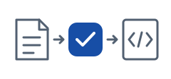

<!-- _class: lead -->
<!-- _header: Governance with evidence -->



# Specflow

Spec-kit governance with superpowers execution skills and adversarial review.

Donal Moloney

28 September 2026

<!--
Specflow connects the artifacts that define a change to the skills that implement it. Spec-kit owns governance; superpowers supplies optional execution skills. Specflow adds commands, saved state, and checks between those responsibilities.

Follow the boundary from the constitution through review and adoption. Scripts enforce explicit rules; they cannot guarantee that a spec describes the right product behavior. The target surfaces are Claude Code and GitHub Copilot CLI. The companion .claude kit is specific to Claude Code.

Source: AGENTS.md, Architecture and Target surface.
-->

---

## Self-review can't prove independence



External evidence, not agreement, closes the review loop.

<!--
A writer can explain a broken implementation convincingly. Give the reviewer the spec and diff in fresh context, then ask for evidence tied to a requirement, and route to a different model where the policy allows it. Different model routing is a review policy, not proof that errors become independent.

The reviewer must report a finding or demonstrate that the named failure checks are absent. A critic then reviews the review: it rejects unsupported claims and flags understated severity, so agreement alone is never the acceptance signal.

Research motivates the design rather than measuring it. Panickssery, Bowman, and Feng document self-preference even when humans rate alternatives as equally good. Zheng and colleagues document position and verbosity bias in model judging. Huang and colleagues find that reasoning self-correction without external feedback can fail or reduce performance. None of these studies measure Specflow's defect reduction or claim every model behaves identically; combining reviewers with failing tests is an engineering inference from their observed limits.

Sources: .claude/agents/code-reviewer.md; .claude/agents/critic.md; docs/review-research.md, sections 3.3 and 3.11. Research: Panickssery et al., LLM Evaluators Recognize and Favor Their Own Generations (2024), https://arxiv.org/abs/2404.13076; Zheng et al., Judging LLM-as-a-Judge with MT-Bench and Chatbot Arena (NeurIPS 2023), https://arxiv.org/abs/2306.05685; Huang et al., Large Language Models Cannot Self-Correct Reasoning Yet (2023 preprint; ICLR 2024), https://arxiv.org/abs/2310.01798. The deck README retains these references.
-->

---

## Specflow connects governance to execution


Saved state lets interrupted work resume.

<!--
Read the diagram as a division of responsibility. Spec-kit produces the constitution, spec, plan, tasks, and checklist. Specflow checks prerequisites and chooses the next command. Superpowers supplies skills when detection finds them; built-in protocols cover missing skills.

Delegation to superpowers is optional. Feature progress lives in progress.yml, and skill detection lives in .specify/superpowers.yml. A resumed command reads this state before continuing. The workflow does not depend on remembering the previous conversation.

Sources: AGENTS.md, Architecture; specflow/extension.yml; specflow/references/workflow-guide.md.
-->

---

## Without gates, approval depends on model judgment



A recorded pass makes the next step auditable.

<!--
A model can answer the same request differently on successive runs. Asking it to remember a rule leaves that rule dependent on interpretation. A gate instead checks an explicit condition, such as an analysis marker or the status of a blocking finding.

Determinism belongs to the check, not to the generated code. The same recorded inputs should produce the same gate decision. A passing check still does not prove that a product requirement was complete. Governance makes the decision inspectable and repeatable.

Sources: improvements/roadmap.md; specflow/commands/execute.md; .claude/hooks/merge-gate.sh.
-->

---

## Six commands connect the workflow


Each command can use a built-in fallback.

<!--
All seven names share the /speckit.specflow. prefix on Claude Code. Copilot CLI uses hyphenated skill names, such as /speckit-specflow-status. Status reports readiness; brainstorm develops the design; tasks decomposes the plan; gate checks readiness before execute drives implementation; review checks the result.

Gate sits between tasks and execute because execute enforces it: execute stops with ANALYZE_REQUIRED when the .analyzed marker gate writes is missing. The .clarified marker gate can also write is a separate, earlier, non-blocking check that overlaps the brainstorm-to-tasks step instead.

This diagram orders Specflow entry points, not every required step. Spec-kit commands create the constitution and spec, clarify requirements, write the plan, analyze artifacts, and check readiness between these points. Missing skills never remove the built-in workflow. Saved YAML state lets interrupted work continue.

Sources: specflow/extension.yml; specflow/commands/status.md; specflow/commands/gate.md; specflow/commands/execute.md; specflow/README.md. The manifest declares seven commands, six workflow hooks, five templates, and ten scripts. The seventh command, agent-event, dispatches a hook payload to a gate instead of joining the workflow, so the diagram shows six.
-->

---

## The constitution gates every command


Each artifact gives the next step a checkable input.

<!--
The constitution must exist before any Specflow command runs. It gives later reviews a stable rule to cite instead of asking reviewers to invent standards during implementation. A team should approve it before using the workflow on a feature.

Spec-kit owns these artifacts. They record the rules, desired behavior, implementation choices, remaining work, and readiness evidence. Feature artifacts live under specs/NNN-*/ at the consuming project root. The constitution lives at .specify/memory/constitution.md.

Sources: AGENTS.md, Architecture; specflow/commands/execute.md; specflow/templates/tasks-template.md.
-->

---

## Execution skills work inside the agreed rules


Missing skills use the built-in workflow protocol.

<!--
Test-driven development, or TDD, starts with a failing behavior check. Implementation passes that check, and refactoring preserves it. This connects acceptance criteria to observable behavior rather than to a model saying that work is complete.

Specflow maps commands to the relevant superpowers skills. Detection chooses the protocol; governance sets the prerequisites. The workflow guide supplies the fallback when a skill is absent. Optional skills must never become an installation gate.

Sources: specflow/references/superpowers-mapping.md; specflow/references/workflow-guide.md; AGENTS.md, Architecture.
-->

---

## Specflow enforces checks, not product correctness



Checks confirm compliance; only humans confirm correctness.

<!--
The enforcement points differ. Constitution and analysis checks live in command contracts. The artifact hook examines edited spec, plan, task, and checklist files. Once a feature has its .clarified marker, unresolved clarification text causes that hook to stop the workflow.

Do not describe all governance as one pre-execution hook. Some checks happen after an edit; others run inside a command or in CI. The merge gate blocks Critical and Important findings until fixed or rebutted. These checks constrain the agent at named boundaries without proving that the implementation meets every product need.

Sources: specflow/commands/execute.md; .claude/hooks/artifact-lint.sh; .claude/hooks/merge-gate.sh; decisions.md, ADR-0006 and ADR-0012.
-->

---

## An install wires the gates into both CLIs


A project that also copies .claude/hooks runs each gate twice.

<!--
The first roadmap wave, G-01 through G-18, merged between PR #8 and PR #53. Later changes added the gate command, the shipped scripts, and the events registration. The manifest now declares ten scripts, including the Python findings and progress validators.

One events: entry registers speckit.specflow.agent-event on pre_tool_use, post_tool_use, and session_start. Spec-kit passes the script no event name, so agent-event.sh reads the event and the surface from the payload and runs the matching gates. Copilot drops matcher, so a Copilot path reaches the post gates only beside a write argument. The native .github/hooks/hooks.json route remains, and its adapter pipes the payload to the same agent-event.sh.

Registration is not the same as a recorded run. Copilot reads a deny on exit 2 and on exit 0; exit 1 discards stdout and the call proceeds, so a gate that cannot find jq fails open on both surfaces.

Sources: specflow/extension.yml, events:; specflow/gates/bash/agent-event.sh; .github/hooks/adapter.sh; decisions.md, ADR-0034, ADR-0035 and ADR-0042. Status checked against the checkout on 28 September 2026; a declared registration alone does not prove runtime behavior.
-->

---

## Four default layers precede additional review


Risk triggers the critic; CI hosts additional checks.

<!--
The proposed stack has seven layers. The four defaults are a spec pre-mortem, a hardened reviewer, a multi-persona panel, and reviewer-written tests. The remaining layers are a critic loop, cross-model review, and test amplification with static application security testing (SAST).

The roadmap assigns the critic to high-risk changes and places cross-model review and SAST in continuous integration (CI). These are adoption policies, not a claim that the committed workflow runs every layer. Current CI runs headless Claude review when credentials exist, adds security review and mutation checks for HIGH risk, and runs Semgrep with --error. Semgrep and mutation step failures fail the job. This does not establish different-vendor review.

The headless review prompt names the findings contract at specflow/references/findings-schema.json, and the gate validates the returned document against it before the merge gate reads it. A schema-valid document is still not proof of a successful live review.

Sources: docs/review-research.md, sections 3.7 and 3.10; .github/workflows/merge-gate.yml. The four-plus-three count comes from the proposed seven-layer stack.
-->

---

## Risk rises above 400 lines or 15 files



Sensitive paths and recognized dependency files also trigger HIGH.

<!--
The classifier compares the base ref with HEAD. Changed lines are additions plus deletions. The comparisons are strictly greater than 400 lines or 15 files: exactly those counts stay STANDARD unless a path rule triggers HIGH. A binary file contributes to the file count without contributing lines.

Sensitive paths include auth, payments, billing, migrations, infra, secrets, and crypto. Dependency matching covers the filenames listed in the script, not every possible manifest. The scorecard script now reads validated findings JSON and computes fixed / (fixed + rejected + rebutted) per reviewer. It needs adjudicated findings; its existence does not establish measured reviewer accuracy.

Sources: specflow/gates/bash/risk-classifier.sh; .claude/review/scorecard.sh; decisions.md, ADR-0005; docs/review-research.md, section 3.9.
-->

---

## Findings make review decisions inspectable

Every finding names its severity, location, evidence, and fix.

**Schema checks structure; reviewers check the evidence.**

<!--
The envelope needs schema_version, reviewer, verdict, and findings. Each finding needs id, severity, location, evidence, and fix. Severity is Critical, Important, or Minor. Verdict is BLOCK, CONCERNS, or CLEAN. The shared shape lets a script read review output without interpreting prose.

Schema validity cannot prove that evidence is true. The merge gate applies a separate policy: Critical and Important findings block unless fixed or rebutted; Minor findings do not block. CI rebuttals use the documented pull-request label path. Committed findings can carry per-finding status.

Sources: specflow/references/findings-schema.json; .claude/review/validate-findings.py; .claude/hooks/merge-gate.sh; decisions.md, ADR-0006 and ADR-0012.
-->

---

## The companion kit needs deliberate installation


The install wires the gates; agents and skills need copying.

<!--
Count direct shell scripts in .claude/hooks and Markdown definitions in .claude/agents: 11 and 34 respectively. Several shell files wrap the shipped gates. The schema lives at specflow/references/findings-schema.json; the validator lives under specflow/gates/python/, with a compatibility wrapper in .claude/review. The repository has six workflows; presentation.yml renders and lints this deck.

The extension ships shared gates under specflow/gates/. Agent definitions, dispatcher skills, and native CLI settings remain separate from the archive. Claude uses .claude/settings.json. Copilot uses .github/hooks/hooks.json and its adapter, which pipes the payload to specflow/gates/bash/agent-event.sh. The .claude wrappers exec the same shipped gates, so both routes expect this checkout's specflow/gates layout; copying .claude alone into an installed project does not satisfy that path. Adapt paths to .specify/extensions/specflow/gates/ when configuring a consumer.

Sources: .claude/hooks/; .claude/agents/; specflow/references/findings-schema.json; .claude/skills/specflow-dispatcher/SKILL.md; .github/workflows/; decisions.md, ADR-0001. Recount both directories before each render; the hook count has already moved twice since this deck's first draft.
-->

---

## Checks run at distinct workflow boundaries


Match each check to its actual event.

<!--
Read this as the developer's sequence of work, not a chain of hook events. The Bash PreToolUse hook checks commits to main. After Edit or Write, PostToolUse runs artifact linting and the test gate. The merge gate runs in the pull-request workflow. A commit does not itself trigger Edit or Write hooks.

Claude SessionStart reloads context on resume or compaction, and Stop records activity and cost. Copilot preToolUse calls the commit guard; postToolUse calls the test and artifact checks; sessionStart restores context. Its adapter turns a preToolUse refusal into deny JSON, but postToolUse reports context after the edit has happened. Check model identifiers, budgets, and credentials in CI. Scripts on disk provide no protection until the intended event or workflow invokes them.

Sources: .claude/settings.json; .github/hooks/hooks.json; .github/hooks/adapter.sh; specflow/gates/bash/test-gate.sh; .github/workflows/merge-gate.yml.
-->

---

## Install the extension, then check readiness

```text
specify init --here --integration claude
specify extension add /path/to/super-spec-new/specflow --dev
/speckit.constitution
/speckit.specflow.status
```

<!--
This mixes terminal and Claude Code commands; it is not a shell script. Run specify init and specify extension add in the consuming project's terminal. Replace /path/to/super-spec-new with the absolute path to this checkout. Run /speckit.constitution and /speckit.specflow.status inside Claude Code.

Install specify-cli with spec-kit >=0.16.2 and put jq on PATH. This local-checkout route does not depend on a published release or catalog entry. Catalog installation needs this repository's catalog configured; the default catalog does not list specflow. Verify the install with specify extension list: Commands: 7 | Hooks: 6. For Copilot use --integration copilot and /speckit-specflow-status. Superpowers remains optional; detection reads .agents/skills/ and ~/.agents/skills/. Installing the extension registers the gates through its events: block, and copies neither the companion agents nor either CLI's own settings file.

Sources: specflow/README.md, Installation; specflow/extension.yml; specflow/commands/status.md; decisions.md, ADR-0001. These audience instructions are not commands run while editing the deck.
-->

---

## Adopt the workflow in three 30-day steps


Each step adds a check the team can operate.

<!--
Days 0 to 30 establish the constitution, gate hooks, and a hardened reviewer. Include clarify, analyze, and checklist habits. Use a real feature to see whether the team can explain why a gate blocked and what evidence clears it.

Days 30 to 60 add Agent Teams and persona reviewers where work can proceed independently. Days 60 to 90 add CI gating and risk-triggered critic review. These intervals are a proposed schedule, not measured delivery times. Advance when the team can operate the preceding checks, rather than treating elapsed time as evidence of readiness.

Source: docs/review-research.md, Part 8, the proposed 30-60-90 day adoption plan.
-->

---

## Humans approve; review stays bounded

Spec approval accepts intent. Merge approval accepts the evidence for shipping.

**Add heavier review only when native primitives prove insufficient.**

<!--
The adoption policy keeps two human approvals: spec approval confirms the behavior the team wants to build, and merge approval confirms that the implementation and its evidence satisfy that decision. Neither approval follows automatically from a model verdict; treat both as team policy that must be configured and practiced, since a command prompt alone does not establish branch protection.

More reviewers create more text, not automatic independence. The review research advises against panels of five or more reviewers and unbounded debate; a smaller panel with explicit lenses makes evidence and duplicate findings easier to trace. Choose a finite critic budget before starting, and add costly review only when risk or observed defects justify it. Try the CLI's own agents and worktrees before adopting another orchestrator.

Sources: docs/review-research.md, Part 8 and its human-gate rules; docs/review-research.md, section 3.12; the operating limits in the supplied deck outline. The count of two refers to spec approval and merge approval; the panel limit is a project recommendation, not a universal research threshold.
-->

---

## Start this week

Adopt the constitution-and-hooks baseline on one feature.

<!--
Start with a constitution rewrite that names the rules reviewers will enforce. Then install the hooks that check those rules at the relevant boundaries. Use one feature to demonstrate a rejected action, the evidence that clears it, and a successful resume after interruption.

That exercise gives the team a concrete adoption decision. Keep the baseline when its rules and failure messages are understandable. Add later review layers against problems observed in that run. The immediate action is to adopt and exercise the baseline on one feature.

Source: docs/review-research.md, Part 8, days 0 to 30; AGENTS.md, Architecture. One feature is the proposed starting scope.
-->
