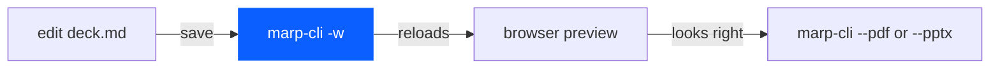
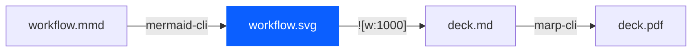

# Use guide: what to diagram

This folder holds `use-guide.md`, the page that says how to view, edit, and
export the deck. Read this file before adding a diagram to it. The guide is
plain Markdown read on GitHub, so it takes Mermaid fences directly; nothing
is rendered ahead of time and no SVG is checked in here.

## What to diagram

The guide has two flows worth a picture. Everything else in it is a command
or a list of conventions and stays as text.

- The edit loop: edit `deck.md`, watch it in the browser, export to PDF or
  PPTX. Four nodes, one direction. It belongs under "Live Preview / Editing
  Workflow", where a reader decides which of the three tools to open.
- The file path from diagram source to slide: a `.mmd` file rendered by the
  Mermaid CLI to an SVG that the deck embeds and the Marp CLI renders. Five
  nodes. It belongs under "Deck Conventions", beside the front-matter rules,
  because it is the one convention the guide cannot state in a sentence.

Do not diagram the install steps or the troubleshooting list. A numbered
command block already shows order, and a diagram of it adds nothing a reader
can act on.

## How to form them

The same six rules as `presentation/marp-deck/README.md` apply: one
direction, at most ten nodes, a label on every edge, one accent on the one
node the section is about, names not sentences, no decoration. On GitHub
the accent comes from a `classDef` line; keep the same blue as the deck so
the two documents read as one set.

The edit loop, as a starting point:

The diagram path:

Check each fence renders on the GitHub preview of the pull request before
merging. A Mermaid parse error shows as the raw source with an error line
above it, and `lint-standards.py` does not catch it.
