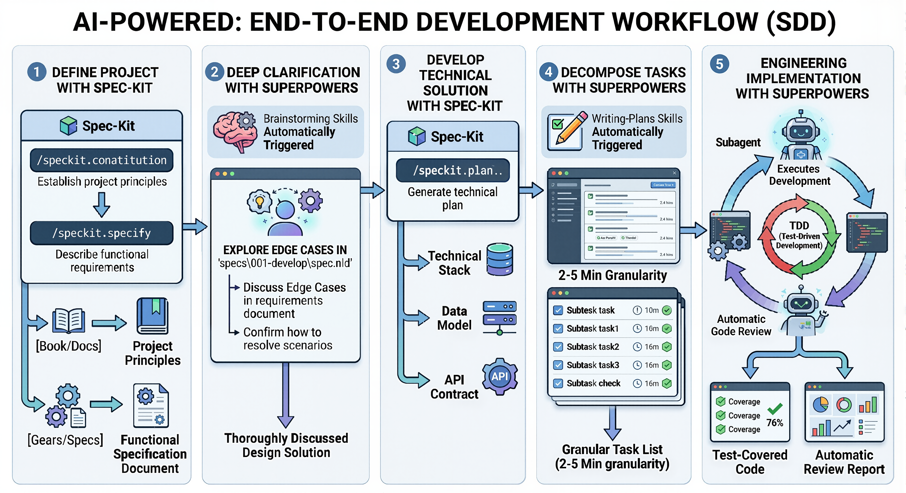

# Superpowers Bridge for Spec-Kit

**Specification-Driven Development with Superpowers**

Superpowers Bridge is a [spec-kit](https://github.com/github/spec-kit) extension that
integrates [obra/superpowers](https://github.com/obra/superpowers) agent capabilities
into the spec-kit development workflow. It works with any spec-kit compatible coding
agent, including [Claude Code](https://docs.anthropic.com/en/docs/agents-and-tools/claude-code),
[Codex CLI](https://github.com/openai/codex) and others.

Spec-kit provides the document structure and governance (constitution, specifications, plans, tasks).
Superpowers provides deep clarification (brainstorming), intelligent task decomposition (writing-plans),
and engineering execution discipline (TDD, subagent-driven development, code review).

## Architecture



The workflow orchestrates 6 phases — from project definition through engineering implementation — with spec-kit handling governance artifacts and superpowers providing intelligent clarification, decomposition, and execution capabilities.

## Installation

### Via Spec-Kit CLI (Recommended)

```bash
specify extension add specflow
```

### From Source

```bash
# Clone the repository
git clone https://github.com/DonalMoloney/super-spec-new.git

# Install via spec-kit from local path
specify extension add ./specflow --dev
```

### As an Agent Skill

If you're using a coding CLI agent (Claude Code, Codex CLI, etc.) and want to use
this as a skill rather than a spec-kit extension, symlink it:

```bash
# Claude Code
ln -sf "$(pwd)/specflow" ~/.claude/skills/specflow
# Codex CLI
ln -sf "$(pwd)/specflow" ~/.codex/skills/specflow
# Other agents (common convention)
ln -sf "$(pwd)/specflow" ~/.agents/skills/specflow
```

### Optional: Install Superpowers

Superpowers Bridge works standalone, but for enhanced capabilities install superpowers skills:

```bash
# Install obra/superpowers (see their repo for latest instructions)
# Skills should be placed in ~/.agents/skills/ or .agents/skills/
```

## Commands

| Command | Description |
|---------|-------------|
| `/speckit.specflow.status` | Show current progress and suggest next step |
| `/speckit.specflow.brainstorm` | Deep-dive edge cases and refine a spec document |
| `/speckit.specflow.tasks` | Generate phased task breakdown with execution markers |
| `/speckit.specflow.execute` | Orchestrate implementation with TDD + subagents |
| `/speckit.specflow.review` | Run code review against spec requirements |

> **Note**: This extension adds 5 commands on top of the core spec-kit commands
> (`/speckit.constitution`, `/speckit.specify`, `/speckit.plan`, `/speckit.tasks`,
> `/speckit.checklist`). The core commands are provided by spec-kit itself.

## Resumable by Design

All project state is persisted as plain-text markdown and YAML files — under
`.specify/memory/` for governance (`constitution.md`) and under `specs/NNN-*/`
for per-feature state (`spec.md`, `plan.md`, `tasks.md`, `progress.yml`).
When a session is interrupted — agent timeout, user leaves, CLI crash — no progress
is lost. Run `/speckit.specflow.status` in a new session to see exactly where you left off:

```
Specflow Project Status
========================
Constitution: Done
Features:
  001-user-auth    [####------] execute (Phase 5/6) — 11/19 tasks done
  002-photo-upload [##--------] brainstorm (Phase 2/6) — 2 open questions

Suggested next step: /speckit.specflow.execute 001
```

Each command automatically detects previous progress and resumes from the
interruption point — skipping completed work, continuing from open questions
or unchecked tasks.

## Getting Started

### 1. Initialize Project Governance

```
/speckit.constitution MyProject
```

This creates the `.specify/` directory structure and interviews you about core principles,
technology stack, and quality gates.

The [constitution template](templates/constitution-template.md) includes a **Code Review Rules** section.
Fill its placeholders with the error-handling convention, test command, forbidden dependencies, and security rules.
Record human approval of the spec before implementation and human approval of the merge before merging.

### 2. Write Your First Spec

```
/speckit.specify "User authentication with email and password"
```

This creates a feature specification at `specs/001-user-authentication/spec.md`
with user stories, requirements, success criteria, an optional STRIDE threat
model, and a traceability table mapping each requirement to its test.

### 3. Brainstorm Edge Cases

```
/speckit.specflow.brainstorm specs/001-user-authentication/spec.md
```

The agent asks probing questions one at a time to discover boundary conditions, error
scenarios, security concerns, and UX pitfalls you may not have considered.

### 4. Plan and Execute

```
/speckit.plan                            # Create technical implementation plan
/speckit.specflow.tasks               # Generate task breakdown with execution markers
/speckit.specflow.execute             # Implement with TDD discipline and checkpoints
/speckit.specflow.review              # Verify implementation against spec
```

## Real-World Example

To see what spec-kit + specflow actually produces after a complete run,
browse the [`examples/static-landing-page/`](examples/static-landing-page/)
snapshot — the verbatim disk output from a real Claude Code session driven
through all 7 stages (constitution → specify → brainstorm → plan → tasks →
execute → review).

Open
[`examples/static-landing-page/web/index.html`](examples/static-landing-page/web/index.html)
in any browser to view the AI-generated landing page directly. The
accompanying [snapshot README](examples/static-landing-page/README.md)
explains how the artifacts were produced and how to reproduce them via
[`scripts/e2e-agent-claude.sh`](scripts/e2e-agent-claude.sh).

## Project Structure

After initialization, your project will contain two top-level directories
created by spec-kit — `.specify/` for tool metadata and `specs/` for
feature artifacts:

```
your-project/
├── .specify/
│   ├── memory/
│   │   └── constitution.md      # Project governance principles
│   ├── superpowers.yml          # Superpowers detection status (auto-managed)
│   └── templates/               # Document templates
├── specs/
│   └── 001-feature-name/
│       ├── spec.md              # Feature specification
│       ├── plan.md              # Implementation plan
│       ├── tasks.md             # Task breakdown
│       ├── progress.yml         # Phase progress tracker (auto-managed)
│       └── checklist-*.md       # Generated checklists
└── ... (your source code)
```

## Workflow

```
Constitution → Specify → Brainstorm → Plan → Tasks → Execute → Review
                            ↑     ↓
                            └─────┘  (iterate until spec is solid)
```

Each phase has an explicit gate — prerequisites are verified before proceeding.
Human checkpoints ensure you control when to advance.

## Superpowers Integration

When obra/superpowers skills are installed, specflow automatically detects and uses them:

| Specflow Command | Enhanced By | Fallback |
|-------------------|-------------|----------|
| `brainstorm` | `brainstorming` skill | Built-in questioning protocol |
| `tasks` | `writing-plans` skill | Template-based decomposition |
| `execute` | `executing-plans` + `subagent-driven-development` + `test-driven-development` | Sequential execution with manual confirmation |
| `review` | `requesting-code-review` skill | Built-in review checklist |

See [superpowers-bridge.md](references/superpowers-bridge.md) for full integration details.

## Contributing to the Spec-Kit Extension Registry

To submit this extension to the [spec-kit community catalog](https://github.com/github/spec-kit/tree/main/extensions):

1. **Fork** the `github/spec-kit` repository
2. **Add an entry** to `extensions/catalog.community.json`:

```json
{
  "id": "superpowers",
  "name": "Superpowers Bridge",
  "version": "1.0.0",
  "description": "Bridges spec-kit with obra/superpowers capabilities (brainstorming, writing-plans, TDD, subagent-driven-development, code-review)",
  "author": "Specflow Contributors",
  "repository": "https://github.com/DonalMoloney/super-spec-new",
  "verified": false,
  "tags": ["superpowers", "brainstorming", "tdd", "code-review", "subagent", "workflow"]
}
```

3. **Add a row** to the Community Extensions table in the spec-kit `README.md`
4. **Submit a Pull Request** using the extension submission template
5. Allow 3-7 business days for automated checks and manual review

See the full [Extension Publishing Guide](https://github.com/github/spec-kit/blob/main/extensions/EXTENSION-PUBLISHING-GUIDE.md) for details.

## License

MIT
